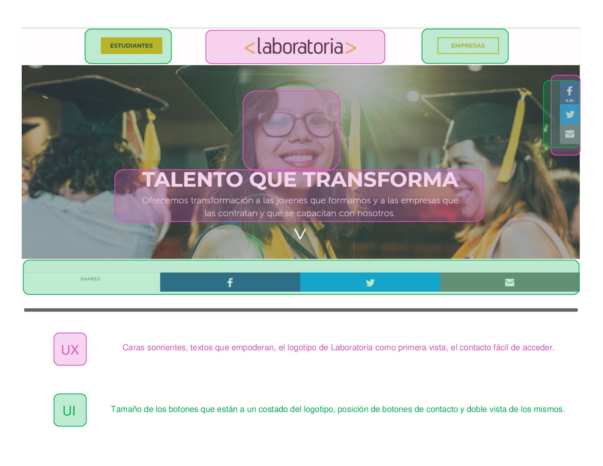
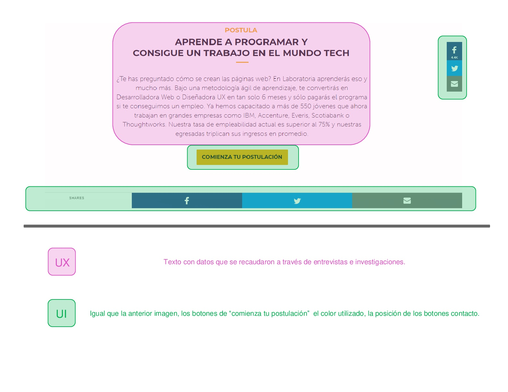
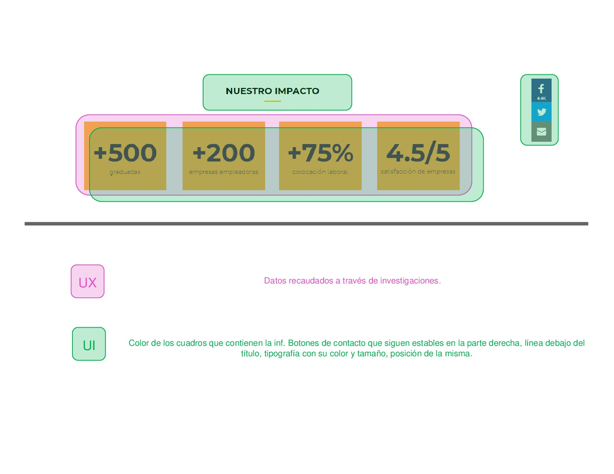
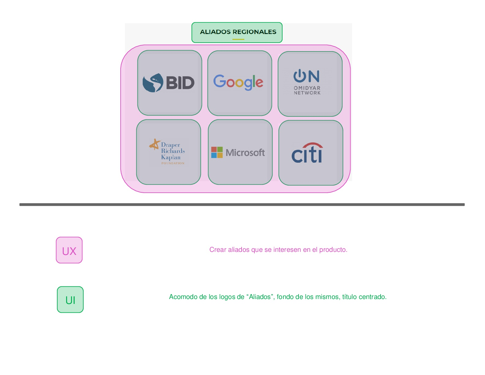
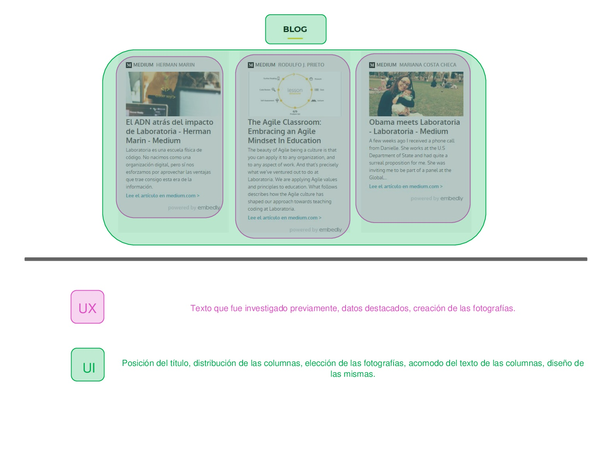
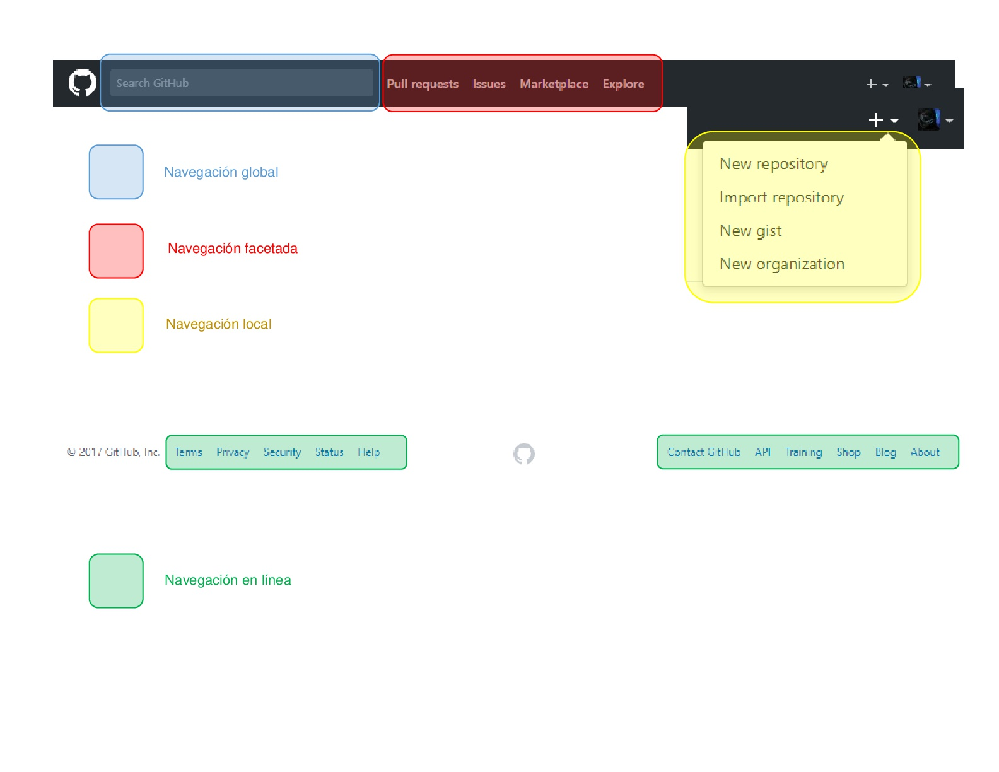
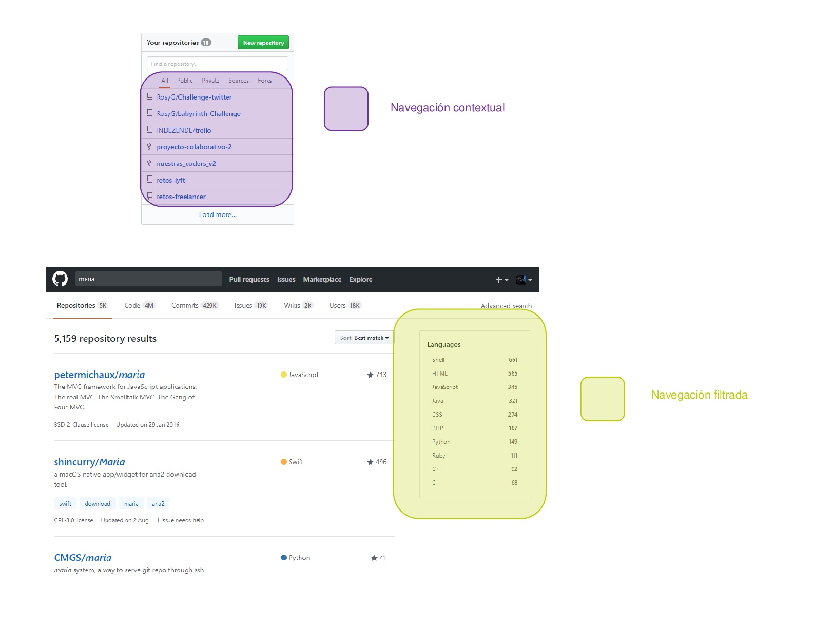
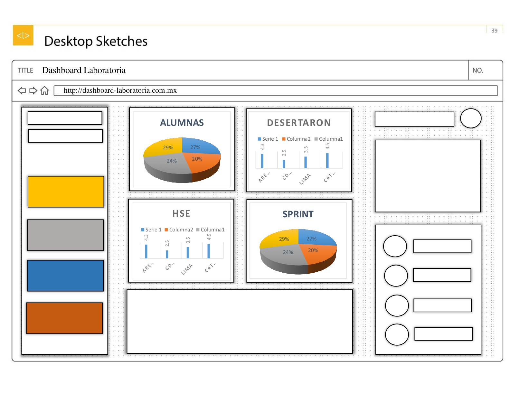

# **Retos UX** <h1>

## Elementos UX y UI de [Laboratoria](http://www.laboratoria.la/). <h2>

En este reto, analizaré gráficamente las partes que conforman el _UX_ y el _UI_ de la página web de **Laboratoria.**

> Para realizar el siguiente análisis recuerda que me base en los conceptos dados en el _self learning_ del _lms_ de **Laboratoria.**

### UX

Gente, felicidad, resolución de problemas, entender necesidades, amor, eficiencia, entretenimiento, placer, deleitar, sonrisas, alma, calidez, personalidad, alegría, satisfacción, gratificación, exaltación, euforia, conveniencia, eficacia, etcétera.

### UI

Navegación, subnavegación, menús, desplegables, botones, enlaces / ligas / links, ventanas, esquinas redondeadas, sombreado, mensajes de error, alertas, actualizaciones, checkboxes, campos de contraseña, campos de búsqueda, entradas de texto, selectores de radio, áreas de texto, estados de hover, estados de selección, estados presionados, información sobre herramientas, anuncios de banner, videos incrustados, animaciones de desplazamiento, desplazamiento, clics, iconografía, colores, listas, presentaciones de diapositivas, texto alternativo, insignias, notificaciones, degradados, ventanas emergentes, carruseles, OK / Cancelar, etcétera.

## Elementos de navegación de [Github](https://github.com/) <h2>
En este reto, se analizará gráficamente las partes de navegación conforman la página web de **Gihub.**

> Para el siguiente análisis, me guié en el _self learning_ del _lms_ de **Laboratoria.**

### Tipos de navegación

* Global: Es la navegación principal del site. Normalmente es persistente y nos ayuda a explorar todas las opciones del site.

* Local: Es la navegación “localizada” a una página o vista. En algunos casos, algunas páginas internas tienen su propia navegación que ayuda al usuario a explorar esa vista en particular.

* Facetada: Es la navegación a través de filtros no editables, definidos previamente por el sistema.

* Filtrada: En este tipo de navegación le damos al usuario todos los resultados de la búsqueda y le damos una serie de opciones de filtros para que él mismo pueda filtrar.

* Contextual: Es la navegación acorde al contexto en el que está navegando el usuario. Se usa principalmente para recomendaciones.

* En línea (inline): Son links de referencia utilizados principalmente en artículos.

* Suplementaria: Es la navegación adicional, a veces temporal, utilizada para señalar algunas funciones a nuevos usuarios.

## Dashboard de Laboratoria <h2>

> Para crear mi _sketch_ para la herramienta de _dashboard_ de **Laboratoria**, tomé como referencia la información dada en el _self learning_ del _lms_ de mismo.

El _dashboard_ es una herramienta utilizada por profesores, training managers, directores y gerentes de Laboratoria para ver rápidamente qué está pasando en el salón de clases de **Laboratoria**. En el dashboard, los usuarios mencionados pueden ver rápidamente estadísticas y datos en tiempo real.

### Datos que hay que tener en cuenta:

* Número de alumnas inscritas
* Número de alumnas que desertaron
* Número y porcentaje de alumnas que pasan el criterio mínimo de evaluación
* Promedio de notas por sprint
* Promedio de notas HSE
* Promedio de notas técnicas

Además, dado que Laboratoria tiene muchas generaciones, regularmente 2 generaciones por año (estas generaciones empezaron en el 2014), y que opera en 4 sedes (Arequipa, Ciudad de México, Lima y Santiago de Chile), es posible que los usuarios quieran ver datos de sedes / generaciones anteriores para poder hacer comparaciones.

